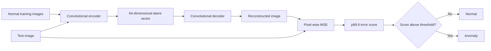

# Industrial Bottle Anomaly Detection

[](https://github.com/ahamdoun14/mvtec-bottle-anomaly-detection/actions/workflows/ci.yml)


An end-to-end portfolio project for **unsupervised industrial anomaly detection**
on the **MVTec AD bottle category**. A convolutional autoencoder learns to
reconstruct defect-free bottles. At inference time, unusually large
reconstruction errors indicate possible defects.

The repository includes modular training and evaluation code, unit tests with
pytest, a GitHub Actions CI workflow, a model card, and an interactive Streamlit
application.

## Project highlights

- Trains exclusively on normal images: `bottle/train/good`
- Produces image reconstructions and pixel-level reconstruction-error maps
- Aggregates each map with its high-error percentile (default: p99.9)
- Calibrates the binary threshold from normal validation scores only (default: p99)
- Evaluates all bottle test defect folders, not only one defect class
- Reports image AUROC, average precision, accuracy, precision, recall, F1, and confusion counts
- Provides reusable tests and continuous integration

## Method



The baseline mirrors the initial experiment while making the input size reusable.
Five stride-2 encoder stages compress a 128 x 128 RGB image to a 4 x 4 feature
representation before the dense latent vector. The decoder reconstructs the image
with transposed convolutions.

## Repository structure

```text
.
├── .github/workflows/ci.yml        # linting and pytest on every push/PR
├── .streamlit/config.toml          # Streamlit appearance and upload limit
├── app.py                          # interactive inference application
├── artifacts/                      # trained model and threshold metadata
├── scripts/
│   ├── train.py                    # training and threshold calibration
│   ├── calibrate.py                # metadata for an existing trained model
│   └── evaluate.py                 # all-defect image-level evaluation
├── src/anomaly_detection/
│   ├── data.py                     # TensorFlow input pipelines
│   ├── metadata.py                 # JSON metadata helpers
│   ├── model.py                    # autoencoder architecture
│   ├── preprocessing.py            # deployment preprocessing
│   └── scoring.py                  # reconstruction scoring and thresholding
├── tests/                          # pytest unit tests
├── MODEL_CARD.md
├── pyproject.toml
└── requirements.txt
```

## Data

Download **MVTec AD** from the official MVTec dataset page and extract it locally.
The expected bottle structure is:

```text
mvtec_anomaly_detection/
└── bottle/
    ├── train/
    │   └── good/
    ├── test/
    │   ├── good/
    │   ├── broken_large/
    │   ├── broken_small/
    │   └── contamination/
    └── ground_truth/
```

The dataset is intentionally not included in this repository. Follow MVTec's
terms when downloading and using it.

## Installation

```bash
git clone https://github.com/ahamdoun14/mvtec-bottle-anomaly-detection.git
cd mvtec-bottle-anomaly-detection

python3.11 -m venv .venv
source .venv/bin/activate
python -m pip install --upgrade pip
python -m pip install -e ".[dev]"
```

You can expose the local dataset path once per terminal session:

```bash
export MVTEC_DATASET_PATH=/home/ayoub/jupyter/Anomaly_detection_project/mvtec_anomaly_detection
```

## Train

```bash
python scripts/train.py \
  --dataset-path "$MVTEC_DATASET_PATH" \
  --category bottle \
  --image-size 128 \
  --batch-size 32 \
  --epochs 50 \
  --latent-dim 64
```

The command creates:

```text
artifacts/
├── best_autoencoder.keras
├── metadata.json
├── training_history.csv
└── training_history.png
```

`metadata.json` stores the image size, score percentile, and validation-derived
threshold used by both evaluation and deployment.

Already have `best_autoencoder.keras` from the original experiment? Generate the
missing deployment metadata without retraining:

```bash
python scripts/calibrate.py \
  --dataset-path "$MVTEC_DATASET_PATH" \
  --category bottle \
  --model-path artifacts/best_autoencoder.keras
```

## Evaluate

```bash
python scripts/evaluate.py \
  --dataset-path "$MVTEC_DATASET_PATH" \
  --category bottle
```

Outputs are written to `reports/`:

- `image_scores.csv`: score and prediction for every test image
- `metrics.json`: image-level metrics
- `score_distribution.png`: normal-versus-defective score histogram

### Results

Add the values from `reports/metrics.json` after your final training run:

| Metric | Value |
|---|---:|
| Image AUROC | _to be added_ |
| Average precision | _to be added_ |
| Accuracy | _to be added_ |
| Precision | _to be added_ |
| Recall | _to be added_ |
| F1 score | _to be added_ |

Do not publish estimated metrics. Commit only results produced by a reproducible
training and evaluation run.

## Streamlit demo

Start the application locally:

```bash
streamlit run app.py
```

The app first looks for:

```text
artifacts/best_autoencoder.keras
artifacts/metadata.json
```

It also lets a user upload a `.keras` model through the sidebar. Upload a bottle
image to display the original, reconstruction, error heatmap, anomaly score, and
binary decision.

For Streamlit Community Cloud, push the repository, select `app.py` as the entry
point, and ensure the trained model and `metadata.json` are available to the app.
Use Git LFS or release storage when a model artifact becomes too large for normal
Git workflows.

## Tests and continuous integration

Run the checks locally:

```bash
ruff check .
pytest -q
```

The workflow in `.github/workflows/ci.yml` performs the same checks for pushes and
pull requests. Tests cover preprocessing, error-map computation, percentile
scoring, threshold calibration, metadata serialization, and model input/output
shape.

## Reproducibility

The training script sets Python, NumPy, and TensorFlow seeds and requests
deterministic TensorFlow operations when supported. Exact numerical reproduction
can still depend on TensorFlow, CUDA, cuDNN, driver, and hardware versions.

## Limitations and next steps

This reconstruction autoencoder is a useful baseline, but it may reconstruct some
defects too well. The next portfolio iteration should compare it with PatchCore
and add mask-based pixel AUROC and AUPRO. Orientation robustness should also be
measured explicitly through controlled rotation experiments rather than assumed.

See [MODEL_CARD.md](MODEL_CARD.md) for intended use and limitations.

## Author

**Ayoub Hamdoun**  
Computational mechanics researcher developing practical machine-learning and
deep-learning skills for industrial engineering applications.

Detailed publishing instructions are available in [GITHUB_SETUP.md](GITHUB_SETUP.md).

## License

Project code is released under the MIT License. The MVTec AD dataset has its own
usage terms and is not covered by this repository's license.
